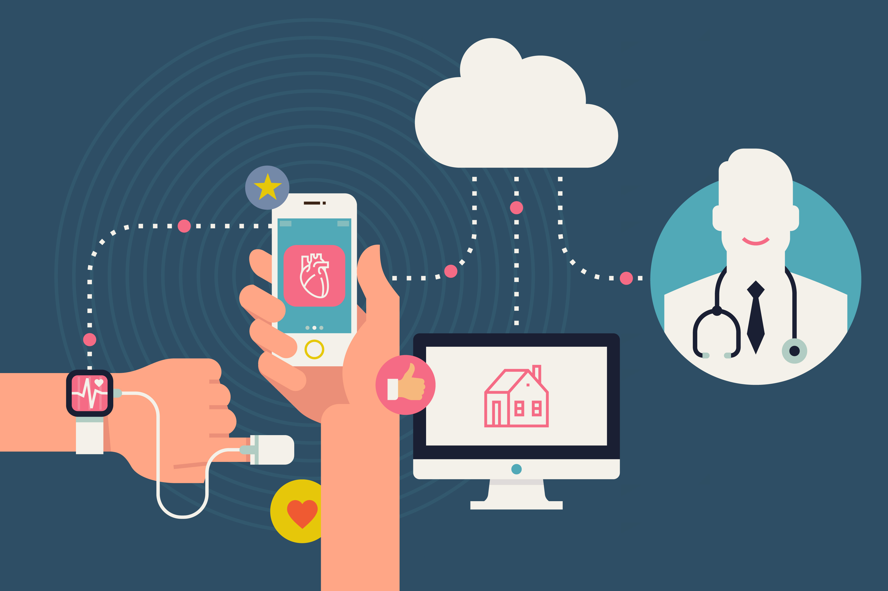
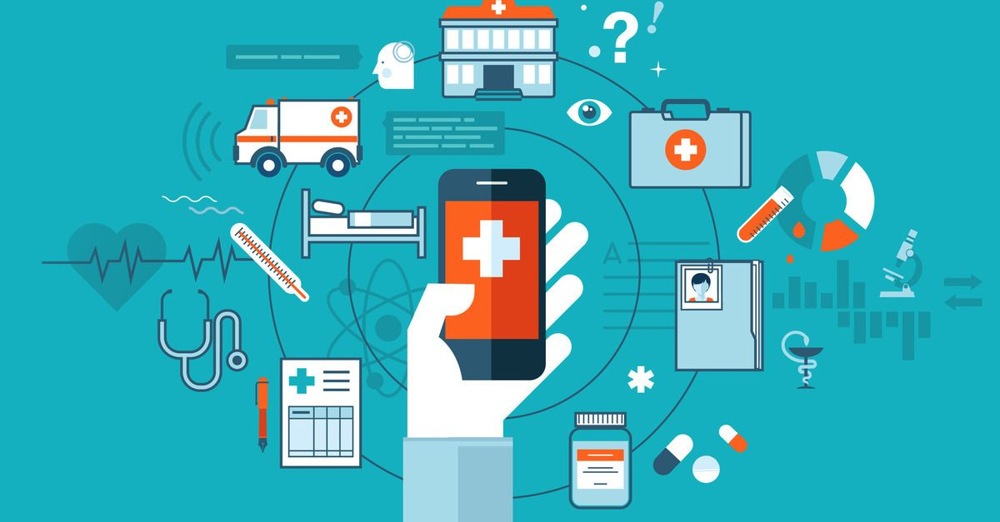
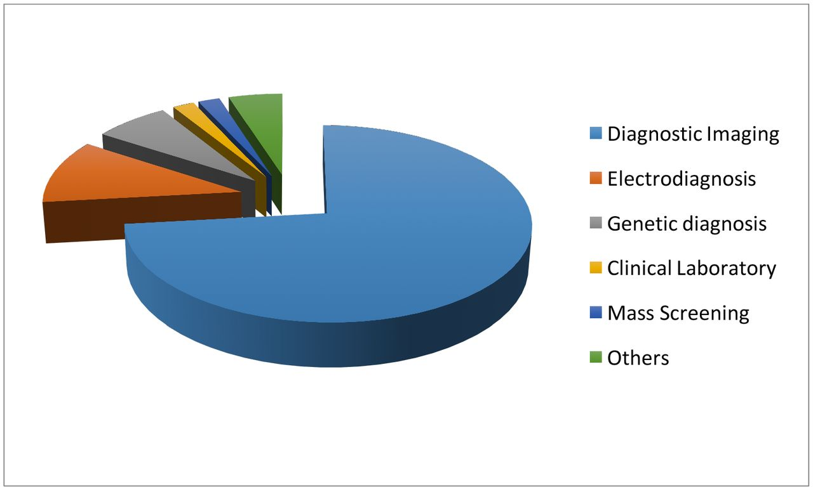
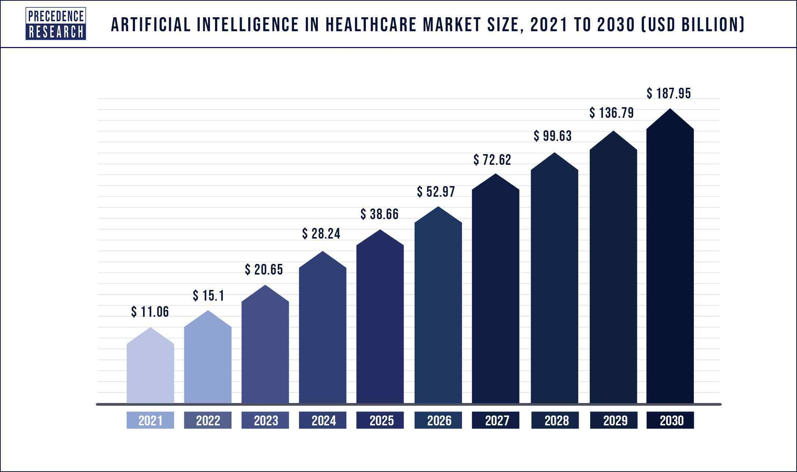
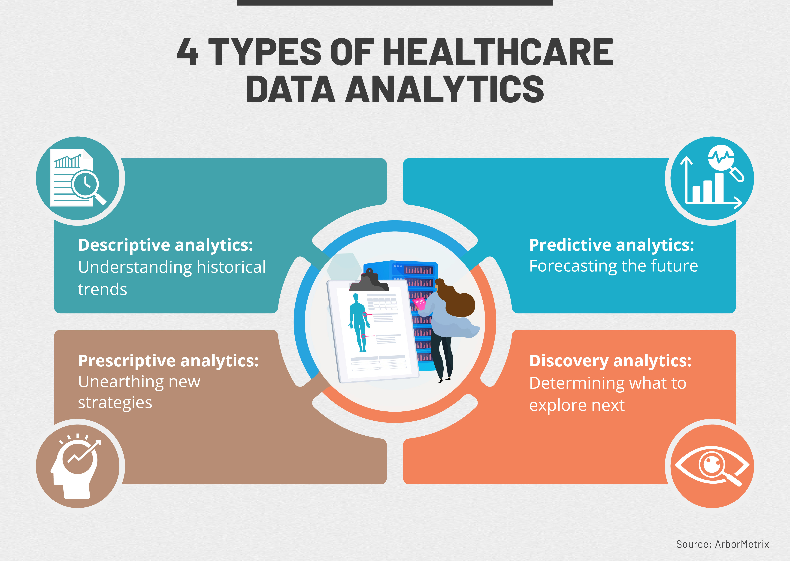

# Healthcare Revolutionizing for a Connected World: The Future of Digital Health

## Introduction
Healthcare has not been exempt from the extraordinary technological
breakthroughs that have changed many other businesses in recent years. Our approach to
healthcare has been completely transformed by the rise of digital health, which has improved
accessibility, effectiveness, and patient outcomes. Digital health has the potential to change
the way that healthcare is provided in the future, from wearable technology and telemedicine
to artificial intelligence and big data analytics. In this blog article, we will examine the
fascinating advancements in the field of digital health and talk about how they affect the
healthcare sector.

## Wearable Devices and Remote Monitoring
Fitness trackers and smartwatches are two examples of wearable technology that are growing quite popular among customers. These gadgets now include sophisticated health monitoring features in addition to tracking physical activity and sleep habits. They may take measurements of vital indicators including blood pressure, heart rate, and blood oxygen levels, giving consumers access to real-time health information. Healthcare professionals may also remotely check on their patients' health and get notifications if anything is out of the ordinary, enabling early intervention and individualized care.

## Telemedicine and virtual care
The provision of healthcare has been fundamentally altered by telemedicine. Patients can consult with medical specialists remotely with the use of digital communication technologies, doing away with the requirement for in-person consultations. For people with restricted mobility or those who live in distant places, this is especially advantageous. Better patient outcomes are achieved with telemedicine because it isconvenient, lowers healthcare expenses, and improves access to experts. Additionally,improvements in virtual reality (VR) and augmented reality (AR) technology have made immersive experiences possible, enabling clinicians to instruct and help medical students in remote surgery.

## Artificial Intelligence(AI) in healthcare

The potential for artificial intelligence to revolutionize healthcare in many different areas is enormous. In order to find trends, forecast results, and aid in diagnosis, machine learning algorithms can evaluate enormous volumes of medical data, including electronic health records, medical pictures, and research papers. Chatbots that are powered by AI can respond to patient questions right away, give simple medical advice, and prioritize cases. Robotic systems with AI capabilities have also demonstrated value in precision surgery, lowering human error, and enhancing surgical results.

AI in healthcare has made significant advancements in the past and continues to transform
the present. It has evolved from basic applications to advanced diagnostic tools, decision
support systems, and personalized medicine. AI algorithms have become more sophisticated, enabling precise analysis of medical images, clinical decision support, remote patient monitoring, natural language processing, drug discovery and development, precision medicine, early disease detection, healthcare system optimization, robotics and surgery, and ethical and regulatory considerations. AI holds immense potential to revolutionize healthcare delivery, improve patient outcomes, and reshape the future of medicine.

From this graph we can see that AI in the healthcare market is increasing rapidly from the
year 2021 which was 11.06 USD. But in the near year 2030,it will grow dramatically and will
become about 187.95 USD. So,artificial intelligence really made a consequential
advancement .

## Big data analytic and predictive medicine

Utilizing the enormous amounts of data thehealthcare sector produces might result in important breakthroughs. Big data analytics makes it possible to extract useful patterns and insights that can guide clinical decision-making, disease preventive plans, and resource allocation. Predictive analytics may identify people who are at risk of acquiring particular disorders and enable early intervention by combining a variety of data sources, including genetics, medical imaging, and patient records. The potential to save lives and enhance public health exists with this proactive approach to healthcare.

## Digital Therapeutics and Personalized Medicine

Software-as-a-medical-device, or digital therapies, has arisen as a cutting-edge medical practice. These digital interventions—which are frequently distributed via smartphone applications—are intended to manage, prevent, or treat medical disorders. They can give individualized advice, keep track of a patient's development, and provide cognitive behavioural therapy or other treatment approaches. Digital treatments can tailor treatment programs to each patient's unique requirements by fusing patient-generated health data with machine learning algorithms, improving results and empowering patients. 

## Ethical Considerations and Data Privacy
Although the digital health revolution has many advantages, it also poses issues with data privacy and ethics. To keep patients' faith in the healthcare system, personal data must be protected and transmitted and stored securely. Finding the ideal balance between protecting individual privacy and allowing access to data for research purposes is a serious concern. In order to prevent exacerbated current health inequities, it is also crucial to ensure fairness in access to digital health technology.

## Conclusion

Digital health technology holds the key to the future of healthcare. The healthcare industry is changing, with wearable technology, telemedicine, artificial intelligence, big data analytics, digital therapies, and other innovations augmenting patient care and enhancing outcomes. To create a sustainable and fair digital health ecosystem, it is crucial to address ethical challenges and data privacy concerns. To guarantee compassionate and patient-centred care in the digital age, it is essential to establish a balance between human touch and technical developments as we embrace these disruptive tools. Digital health is leading this transformation in healthcare, which has a promising future.

### References
●		Wu, M. & Luo, J. (Fall, 2019). Wearable technology applications in healthcare: A literature review. Online Journal of Nursing Informatics (OJNI), 23(3)

●	Herzer KR, Pronovost PJ. Ensuring Quality in the Era of Virtual Care. JAMA.
2021;325(5):429–430. doi:10.1001/jama.2020.24955

●	Jiang F, Jiang Y, Zhi H, et alArtificial intelligence in healthcare: past, present and futureStroke and Vascular Neurology 2017;2:doi: 10.1136/svn-2017-000101

●	Dash, S., Shakyawar, S.K., Sharma, M. et al. Big data in healthcare: management, analysis and future prospects. J Big Data 6, 54 (2019). https://doi.org/10.1186/s40537-019-0217-0

●	Dang A, Arora D, Rane P. Role of digital therapeutics and the changing future of healthcare. J Family Med Prim Care. 2020 May 31;9(5):2207-2213. doi: 10.4103/jfmpc.jfmpc_105_20. PMID: 32754475; PMCID: PMC7380804.

●	B.D. Weinberg et al.Internet of Things: convenience vs. Privacy and secrecy Bus. Horiz. (2015)

●	H. Capon et al. Realising the technological promise of smartphones in addiction research and treatment: an ethical review
